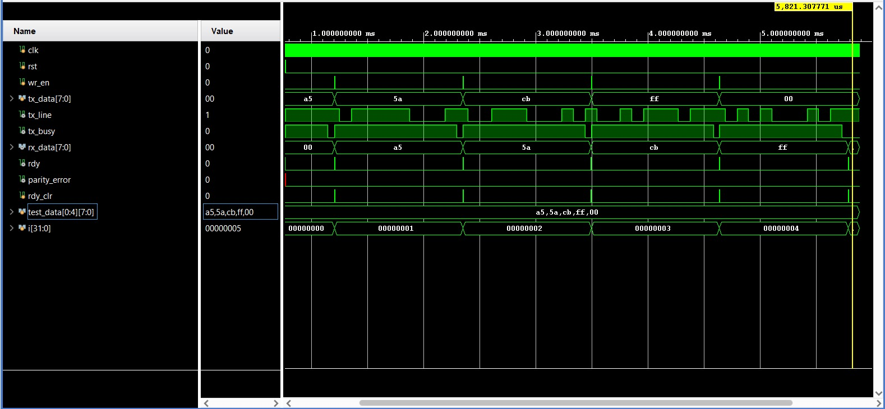

# uart-verilog
UART TX/RX system in Verilog HDL featuring baud rate generation, FSM framing logic, parity checking, and XOR encryption. Implemented using Xilinx Vivado and verified through simulations with waveform analysis in GTKWave.

# UART Communication System in Verilog
# Overview

This project implements a complete UART (Universal Asynchronous Receiver Transmitter) communication system using Verilog HDL. The design includes transmitter and receiver modules, a baud rate generator, FSM-based framing logic, parity generation and checking for error detection, and a simple XOR-based encryption mechanism for basic data security.

The design was implemented and simulated using Xilinx Vivado, and waveform analysis was performed using GTKWave.

# Features

UART Transmitter (TX)

UART Receiver (RX)

Baud Rate Generator

FSM-based control logic

Parity generation and checking

XOR-based encryption for transmitted data

Testbench-driven verification

Waveform analysis

# System Architecture
        +----------------------+
        |  Baud Rate Generator |
        +----------+-----------+
                   |
                   v
           +---------------+
           | UART TX       |
           | (Encryption)  |
           +-------+-------+
                   |
              Serial Line
                   |
           +-------v-------+
           | UART RX       |
           | (Decryption + |
           |  Parity Check)|
           +---------------+

The top module (uart_top.v) integrates all modules and connects the transmitter, receiver, and baud generator.

# UART Frame Format
| Start | Data (8 bits) | Parity | Stop |
|   0   | D0 D1 D2 D3 D4 D5 D6 D7 |  P  |  1  |

Start bit → Indicates beginning of frame

Data bits → 8-bit data payload

Parity bit → Used for error detection

Stop bit → Marks the end of transmission

# Encryption

A lightweight XOR encryption method is used before transmission.

Encrypted_Data = Data XOR Key

The receiver performs the same XOR operation to recover the original data.

# Tools Used

Verilog HDL

Xilinx Vivado for design and simulation

GTKWave for waveform visualization

# Project Structure
```
uart-verilog/
│
├── src/
│   ├── uart_top.v
│   ├── uart_tx.v
│   ├── uart_rx.v
│   └── baud_generator.v
│
├── testbench/
│   └── uart_tb.v
│
├── images/
│   └── uart_sim_waveform.png
│
└── README.md
```
# Simulation

Write UART TX and RX modules in Verilog.

Implement the baud rate generator.

Create a testbench to simulate data transmission.

Run simulation in Vivado.

Generate .vcd waveform file.

Open waveform in GTKWave for signal analysis.

# Example Waveform



# Author

Lewin Mariya
